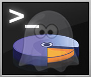

commandline-fusioncharts
========================

> Shell-command FusionCharts to render as image (using PhantomJS), *bye bye Web Browser!*

========

## How to use 

	./phantomjs controller.js pathXMLDataFile.xml
	

## Features
1. Create and save chart as images at command line sans, Web Browser
2. Choose form JPG, PNG or GIF
2. Create high resolution chart images by magnifying the charts without distortion
3. Create thumbnail view of charts

## Prerequisites

1. Download and Install [PhantomJS](http://phantomjs.org/download.html)
2. Download [FusionCharts Suite XT](http://www.fusioncharts.com/downlaod)

## Steps

1. Create a folder and place PhantomJS binary in it (in case you have not set PhantomJS in path)
1. Get `FusionCharts.js`, `FusionCharts.HC.js`, `FusionCharts.HC.Charts.js`, `FusionCharts.HC.PowerCharts.js`, `FusionCharts.HC.Widgets.js`, `FusionCharts.HC.Maps.js`, `jquery.min.js` from **FusionCharts Suite XT** Download Pack
2. Get desired FusionMaps XT map definition file, for example, `FusionCharts.HC.World.js` from **FusionCharts Suite XT** download pack.
3. Put all the above mentioned files in a folder
4. Copy `control.js` and `view.html` from this repository
5. Create an XML file that contains data and configurations for one or more chart/map/gauge
6. Go inside the folder using commandline/terminal 
7. Execute! `./phantomjs controller.js pathXMLDataFile.xml`
	

## Try it

You can try the ready-to-use example provided here:

	phantomjs controller.js SampleData.xml

## Commandline Syntax
	phantomjs control.js XMLPath [CaptureDelayInMilliseconds] [ZoomFactor]

## XML Structure

### Example
A small example XML:

	<app outputFolder='chartImages/' captureDelayMs='200' outputType='png'>
		<visualization type='sparkline' width='300' height='25' outputFilename='cisco-stock'>
        	   <chart caption='Cisco' palette='1' canvasLeftMargin='110'>
        			<dataset>
        				<set value='38.42' />
	        			<set value='41.43' />
    	    			<set value='34.78' />
        				<set value='40.67' />
        				<set value='44.12' />
        				<set value='38.45' />
 	             	</dataset>
    	         </chart>
        	</visualization>
			<visualization type='pie2d' width='500' height='400' outputFilename='sales-contrib'>
        	   <chart caption='Sales contribution' >
        			<set value='4034355' label='Alt' />
        			<set value='1202300' label='For' />
        			<set value='800000' label='Chh' />
             	</chart>
        	</visualization>
	</app>

### Explanation:

1. `<app>` is the root node
2. `<app>` may have the following configuring attributes:
      1. `outputType` - Image format (it can be `jpg`, `png`, or `gif`, default is `jpg`)
      2. `outputFolder` - Path where output files will be stored, make sure to add a `/` at the end. If not specified, all output files will be stored in the the folder where the application is running)
      3. `captureDelayMs` - A minimum delay in milliseconds is required for JavaScript to breath (default is `300`)
      4. `zoom` - It the magnification factor as number. Default is `1` which means `100%`. Thus, `0.1` will reduce the image to `10%` whereas `10` will magnify the image `10 times` the original.

3. Each chart is defined through `<visualization>` node, where this node need the following attributes: 
    1. `type` - Chart type, as per FusionCharts JavaScript Alias of charts, maps ans gauges present in  FusionCharts XT[^1], FusionWidgets XT [^2], PowerCharts XT [^3] and FusionMaps XT [^4]
    
[^1]: http://docs.fusioncharts.com/charts/?Introduction/ChartList.html

[^2]: http://docs.fusioncharts.com/widgets/?Introduction/ChartList.html

[^3]: http://docs.fusioncharts.com/powercharts/?Introduction/ChartList.html

[^4]: http://docs.fusioncharts.com/maps/?introduction/MapsList.html)
        
    2. `width` - in pixels without 'px' suffix
    3. `height` - in pixels without 'px' suffix
    4. `output`  - File name (without the extension)
 

4. A `<visualization>` node must have a single `<chart>` or `<map>` node. This `<chart>` or `<map>` contains the data for the chart, map or gauge as per standard [FusionCharts XML specifications](http://docs.fusioncharts.com/) for the particular chart, map or gauge.

## Works on 
1. Microsoft Windows 
2. Apple Mac OS X
3. Linux

## Limitations
1. Converting individual chart to PDF is an issue due to a [limitation](https://github.com/ariya/phantomjs/issues/10465) of PhantomJS

## Future Possibilities:

1. Can be programmed to batch export
6. Can provide Base64 encoded image data as string for advanced use like email inline attachment
7. Can configure PDF paper like orientation, paper size, border
8. Can be set to work as a standalone export server 
9. Pretty soon phantomJS v2 will arrive with more robust webkit and more features

## Version
* v0.0.9.2 - 2013-05-24

## Author
[**Sudipto Chudhury**](email:mail@sudipto.com)

## License
> Copyright (C) 2013 Sudipto Choudhury (mail@sudipto.net)

Permission is hereby granted, free of charge, to any person obtaining a copy of this software and associated documentation files (the "Software"), to deal in the Software without restriction, including without limitation the rights to use, copy, modify, merge, publish, distribute, sublicense, and/or sell copies of the Software, and to permit persons to whom the Software is furnished to do so, subject to the following conditions:

The above copyright notice and this permission notice shall be included in all copies or substantial portions of the Software.

THE SOFTWARE IS PROVIDED "AS IS", WITHOUT WARRANTY OF ANY KIND, EXPRESS OR IMPLIED, INCLUDING BUT NOT LIMITED TO THE WARRANTIES OF MERCHANTABILITY, FITNESS FOR A PARTICULAR PURPOSE AND NONINFRINGEMENT. IN NO EVENT SHALL THE AUTHORS OR COPYRIGHT HOLDERS BE LIABLE FOR ANY CLAIM, DAMAGES OR OTHER LIABILITY, WHETHER IN AN ACTION OF CONTRACT, TORT OR OTHERWISE, ARISING FROM, OUT OF OR IN CONNECTION WITH THE SOFTWARE OR THE USE OR OTHER DEALINGS IN THE SOFTWARE.

